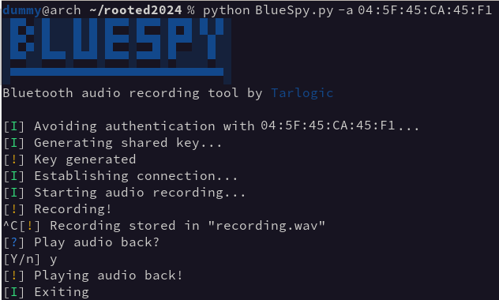

# BlueSpy - PoC to record audio from a Bluetooth device



This repository contains the implementation of a proof of concept to record and replay audio from a bluetooth device without the legitimate user's awareness.

The PoC was demonstrated during the talk **BSAM: Seguridad en Bluetooth** at **RootedCON 2024** in Madrid.

It's designed to raise awareness about the insecure use of Bluetooth devices, and the need of a consistent methodology for security evaluations. That's the purspose of **BSAM, the Bluetooth Security Assessment Methodology**, published by Tarlogic and available [here](https://www.tarlogic.com/bsam/).

This proof of concept exploits the failure to comply with the [**BSAM-PA-05 control**](https://www.tarlogic.com/bsam/controls/bluetooth-pairing-without-interaction/) within the BSAM methodolgy. Consequently, the device enables the pairing procedure without requiring user interaction and exposes its functionality to any agent within the signal range.

More information on our [blog](https://www.tarlogic.com/blog/bluespy-spying-on-bluetooth-conversations/).

## Requirements

The code is written in Python and has been tested with Python 3.11.8, but it mainly uses widely available tools in Linux systems.

The PoC uses the following tools:
+ `bluetoothctl`
+ `btmgmt`
+ `pactl`
+ `parecord`
+ `paplay`

In Arch Linux distributions, `bluetoothctl` and `btmgmt` can be installed with the package `bluez-utils`, while `pactl`, `parecord` and `paplay` are available in the `libpulse` package.

For the PoC to work, it is necessary to have a working instalation of the BlueZ Bluetooth stack, available in the `bluez`package for Arch Linux distributions. A working instalation of an audio server compatible with PulseAudio, such as PipeWire, is also required to record and play audio.

## Setup

Ensure that your device is capable of functioning as an audio source, meaning it has a microphone, and that it is discoverable and connectable via Bluetooth.

For instance, to be discoverable and connectable, the earbuds used during the talk must be outside of their charging case. By default, they only activate the microphone when placed in the user's ears, although this setting can be adjusted in the configuration app.

Additionally, ensure that the device is not already connected, or alteratively, that it supports multiple connections.

## Execution

Firstly, the address of the device must be discovered using a tool such as `bluetoothctl`:

```
$ bluetoothctl
[bluetooth]# scan on
```

Once the address of the device is discovered, the script can handle the rest:

```
$ python BlueSpy.py -a <address>
```

Note: The script might prompt for superuser permissions to modify the configuration of your **BlueZ** instance and pair with the remote device.

## Troubleshooting

`BlueSpy.py` is the main script that executes every step of the process. However, if you encounter issues with nay of the phases, so it might be helpful to execute them individually:
+ `pair.py` utilizes the command-line tool `btmgmt` to modify the configuration of your **BlueZ** and initiate a pairing process with the remote device. The exact commands used are in the `pair` function inside `core.py`.
+ `connect.py` utilizes the command-line tool `bluetoothctl` to initiate a quick scan (necesary for BlueZ) and establish a connection to the device. The exact commands used are in the `connect` function inside `core.py`.
+ `just_record.py` utilizes the command-line tools `pactl` and `parecord` to search for the device in the system's audio sources (it must function as a microphone) and initiate a recording session. The exact commands used are in the `record` function inside `core.py`.
+ The `playback` function inside `core.py` executes `paplay` to play back the captured audio.

If you encounter issues with any of the phases, examine the commands in `core.py` and try to execute them in a shell. This will provide more information on what may be failing.

## References

If you have any questions regarding how the Bluetooth standard operates or how to assess the security of a Bluetooth device, please refer to our BSAM methodology webpage:
+ [BSAM: Bluetooth Security Assessment Methodology](https://www.tarlogic.com/bsam/)

